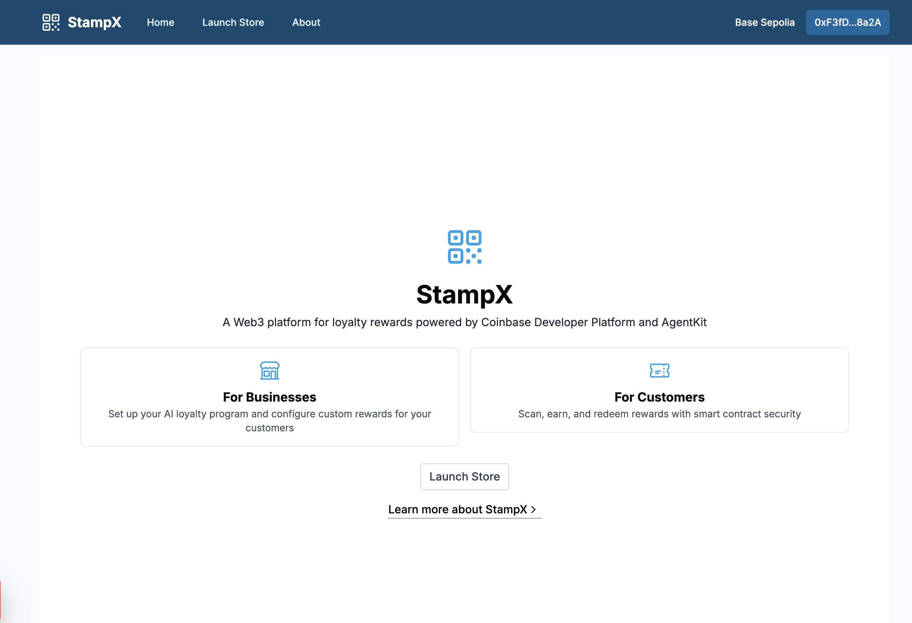
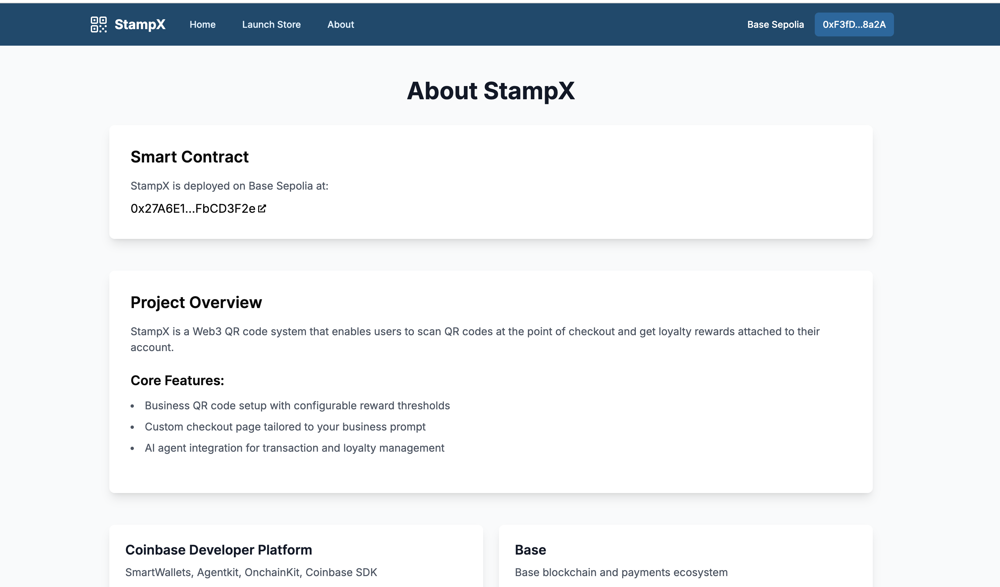
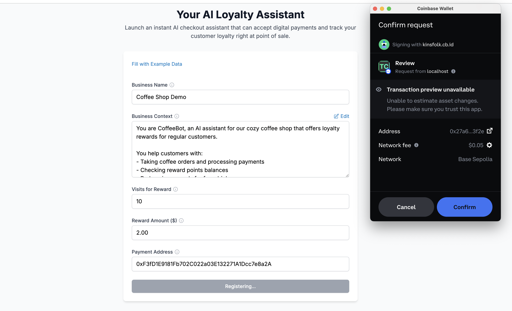
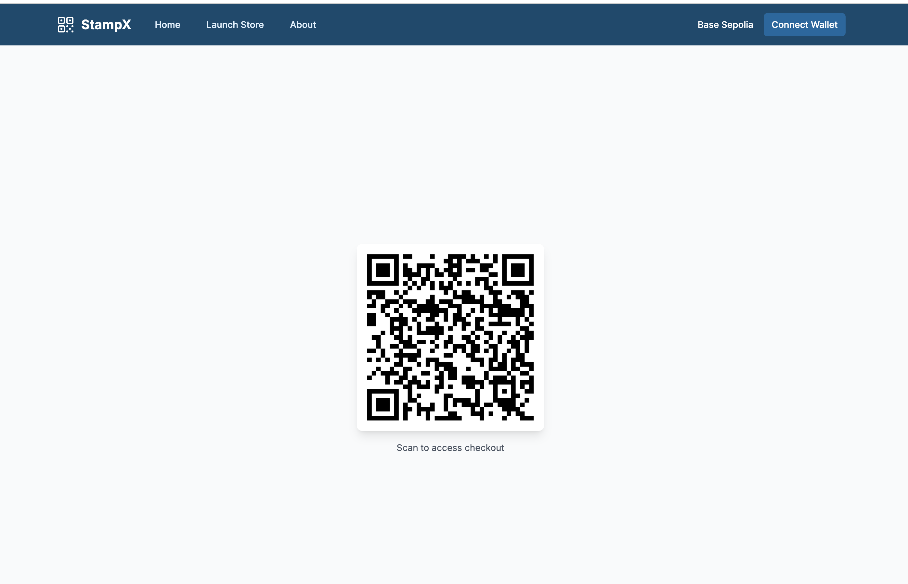
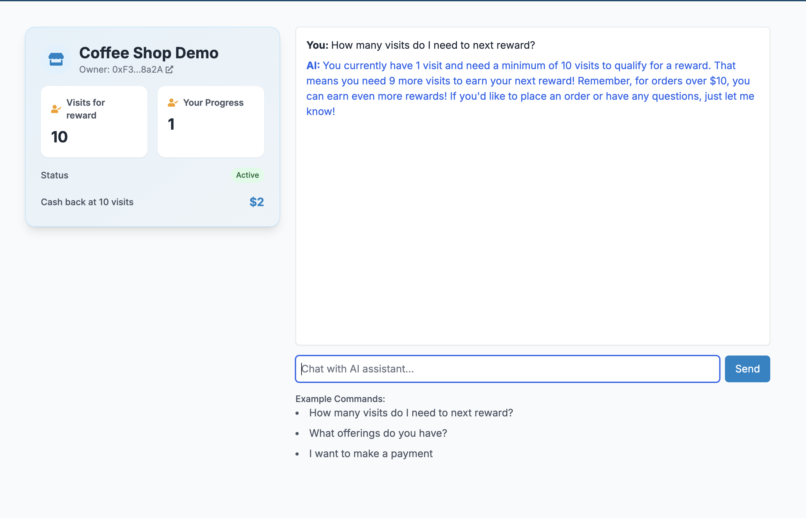
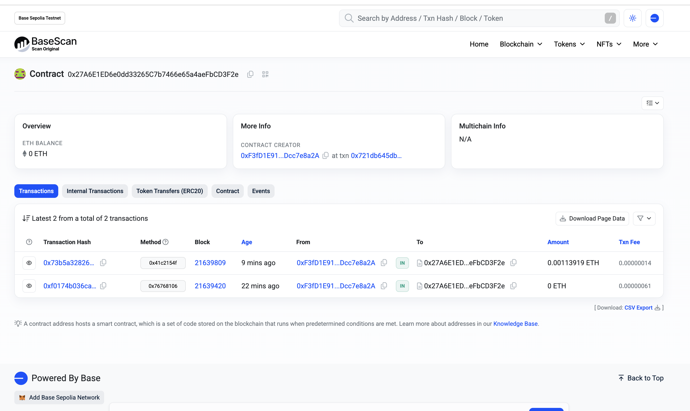
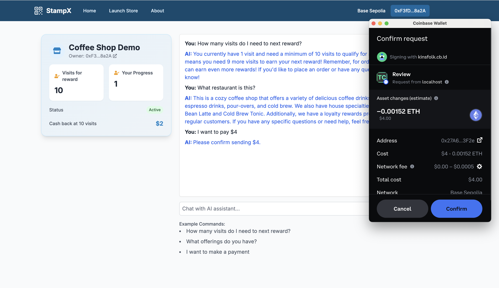

  

# StampX

A Web3 Loyalty Program Platform with agent-driven contract interactions.

Built for Agentic Ethereum 2025.

Video demo:

Live Demo Url: 

## Inspiration

We wanted to revolutionize traditional loyalty programs by bringing them to Web3. Many small businesses struggle with customer retention and implementing reward systems, while customers juggle multiple loyalty cards and points systems. We saw an opportunity to solve this with blockchain technology.

## Example storefront

QR Code (would be printed and displayed in the store): https://stampx.vercel.app/qr/0x47a66666899c9ed775e5b1942c435d4e95ca445940468975d583d050a23ae8ef

Storefront chat: https://stampx.vercel.app/checkout/0x47a66666899c9ed775e5b1942c435d4e95ca445940468975d583d050a23ae8ef

## What it does

StampX is a decentralized loyalty program platform that allows businesses to:

- Create and manage their own loyalty programs on the blockchain
- Set custom reward thresholds and amounts
- Track customer transactions and points
- Integrate with an AI-powered chat interface for seamless customer interactions

Customers can:

- Earn points across multiple businesses with a single wallet
- View their points balance and rewards
- Interact with businesses through an AI chat interface
- Redeem rewards automatically through smart contracts

## Technologies used

1. <b>Coinbase Developer Platform</b>

   - AgentKit: Core of the checkout/loyalty experience. Used to build and deploy AI agents that can:
     - Process natural language store queries
     - Execute on-chain transactions
     - Check loyalty point balances
     - Verify reward eligibility
   - OnchainKit: Manages real-time blockchain data and UI components.
   - Coinbase SDK & Chrome Extension: Handles wallet connections with wagmi integration and coinbase connector from the sdk. AgentKit is used to trigger wallet workflows.

2. <b>Autonome</b>

   - Hosts our custom AgentKit deployment with:
     - Store-specific training data and context
     - Transaction capabilities
     - Points calculation logic
     - Reward validation rules
   - Endpoint: `https://autonome.alt.technology/stampx-ighkdb`
   - Manages real-time chat state and context persistence
   - Handles concurrent user sessions and load balancing for separate customer interactions.

3. <b>Base</b>

   - Primary chain for smart contract deployment and loyalty tracking
   - Benefits:
     - Low transaction costs for payment sends accrual
     - Fast finality for instant rewards
     - EVM compatibility for tooling support
   - Contract Address: `0x27A6E1ED6e0dd33265C7b7466e65a4aeFbCD3F2e`
   - Uses Base Sepolia testnet for development and testing
   - CDP connected with onchainkit in the UI

4. <b>Nethermind</b>
   - Main AI agent functionality for the commerce use case is powered by solidity contracts and is open source.
     - Smart contract event emission
     - Automated reward distribution and validation
     - Natural language processing for user queries
     - Transaction intent detection
   - Integrates with store-specific business logic
   - Handles multi-step transactions and account state

Base Sepolia smart contract for StampX: https://sepolia.basescan.org/address/0x27A6E1ED6e0dd33265C7b7466e65a4aeFbCD3F2e

Project is open source, available here: https://github.com/cbonoz/agentic25

Core:

- Frontend: Next.js, TailwindCSS, wagmi
- Smart Contracts: Solidity, Hardhat
- AI Integration: GPT-4 API for chat interactions
- Blockchain: Deployed on Ethereum testnet
- Authentication: Web3 wallet integration

## Challenges We ran into

- Implementing secure point tracking on the blockchain
- Creating a seamless UX that bridges Web2 and Web3
- Handling real-time updates for transactions and points
- Optimizing smart contract gas costs

### Doing a StampX production deployment

The StampX project is currently deployed on the Base Sepolia testnet. For production deployments (at your own discretion, these would be the next immediate steps):

1. Replace env
2. Update siteConfig in config.ts with production values
3. Redeploy smart contract on Base
4. Redeploy agentkit with Base mainnet
5. Make new website deployment (using nextj)

## What's next for StampX

- Multi-chain support: Expand beyond Base to include other EVM-compatible chains like Ethereum mainnet, Polygon, and Arbitrum, allowing businesses to choose their preferred network.

- Production deployment: Launch on Base mainnet with a focus on onboarding small to medium-sized businesses in the food and retail sectors.

- Enhanced AI capabilities: Implement personalized recommendation systems that analyze customer purchase history and preferences to suggest relevant products and optimize reward strategies.

- Cross-business rewards: Enable businesses to form partnerships and allow customers to earn and redeem points across multiple participating merchants.

### Screenshots

#### Home Page

  

#### About Page

  

#### Launching a new store via smart contract

  

#### QR Code for Storefront

  

#### AI Chat Interface (customer facing)

  

#### Smart Contract Interaction

  

#### Payment Process

  

